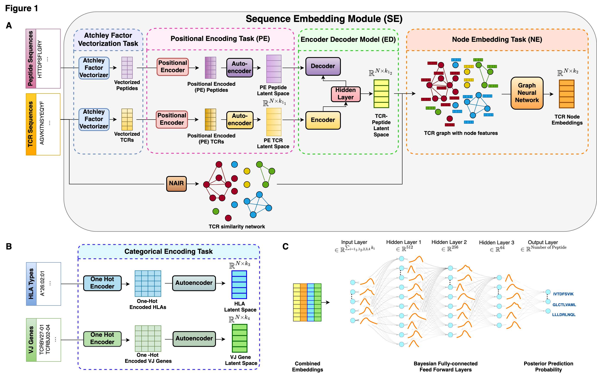

<h1 align="center">
    Pep-TCRNet
</h1>

**Pep-TCRNet** is a novel approach to constructing a prediction model that can evaluate the probability of recognition between a TCR and a peptide amino acid sequence while combining inputs such as TCR sequences, HLA types, and VJ genes. 

## Requirements
To successfully run Pep-TCRNet, ensure the following packages and libraries are installed in your environment. The code was developed and tested using Python 3.8, and other required packages are listed below.

### System Requirements

- Python 3.8 
- TensorFlow 2.13.0
- A machine with a GPU is highly recommended for training, especially for large datasets.

### Python Libraries

The `requirements.txt` file includes the necessary Python packages. Install these dependencies using the following command:

```bash
pip install -r requirements.txt
```

## How does PepTCR-Net predicts the probability of recognition?
Pep-TCRNet operates in two key steps:
1. **Feature Engineering**:
- This step processes different types of variables:
  - **TCR and peptide amino acid sequencing data**: The model incorporates neural network architectures inspired by language representation models and graph representation model to learn the meaningful embeddings.
  - **Categorical data**: Specialized encoding techniques are used to ensure optimal feature representation for HLA types and VJ genes. 
2. **Prediction Model**:
- The second step involes training a prediction model to evaluaate the likelihood of a TCR recognizing a specific peptide, based on the features generated in the first step.

<p align="center">  </p># Pep-TCRNet
